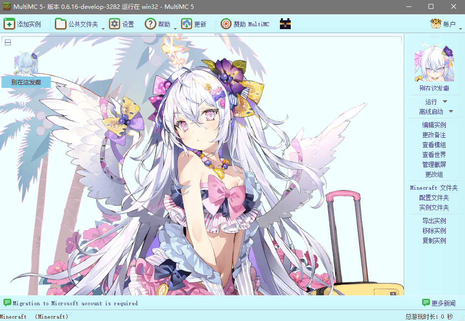

<h1 align="center">
   
  
   
  For <a href="https://multimc.org/">MultiMC</a>
  Or <a href="https://PolyMC.org/">PolyMC</a>
  And <a href="https://prismlauncher.org/">PrismLauncher</a>
   
</h1>

  

只有主题配色和图标,没有背景,你可以添加你想要的任何图片。

# 使用

## 主题设置: 

将`themes`文件夹放置于MultiMC/PolyMC根目录下
`\MultiMC\themes`
>点击设置>launcher>用户界面>主题>颜色>选择

## 背景更换:

1080p显示器窗口化推荐分辨率800x600，你也可以改themeStyle.css文件，修改图像摆布对齐方式。

将图片的名称改为

`image.png`

放置于以下路径

`\MultiMC\themes\custom\resources\image.png`

重启MultiMC即可

## 图标设置:

将 `iconthemes` 文件夹放置于 MultiMC/PolyMC 根目录下
`\MultiMC\iconthemes`

>点击设置>launcher>用户界面>主题>图标>选择`自定义`

# 其他

如果你想的话也可以下载ico文件作为快捷方式的图标。

## 如何制作自己的主题？

## 如何制作自己的图标？

  <a href="https://github.com/MultiMC/Launcher/wiki/Custom-Icons/">自定义图标</a> 

  <a href="https://github.com/MultiMC/Launcher/tree/develop/launcher/resources/">预设</a> 

# 许可

[MIT License](./LICENSE.md)

